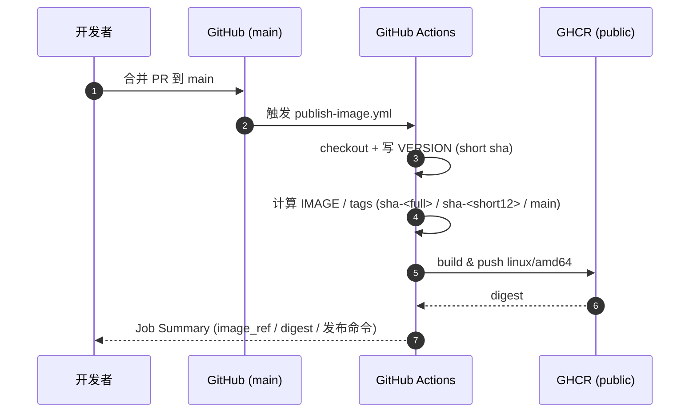
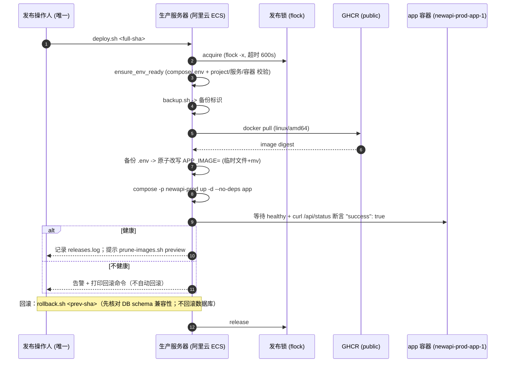

# CI/CD：GitHub Actions 构建镜像 → GHCR → 生产只拉取

本文说明「大力牛」生产环境的镜像交付链路。目标是**把镜像构建从生产服务器搬到 GitHub Actions**，
生产服务器只做 `docker pull` + 重建 `app` 容器（compose project `newapi-prod`）。

---

## 1. 端到端链路

PR 合并 → `main` 分支 → GitHub Actions 构建 `linux/amd64` 镜像 → 推送 GHCR（**public**）→
唯一发布操作人在服务器上执行 `deploy.sh <full-sha>`。

- CI 产出镜像 tag：`sha-<完整40位小写sha>`（唯一权威，发布/回滚锚点）、`sha-<short12>`（便利别名）、`main`（移动指针，**禁止用于发布记录**）。
- **不产出 `latest`**，避免「移动指针」造成发布记录不可追溯。
- 只构建 `linux/amd64`（阿里云 ECS x86_64），默认不做 multi-arch。
- CI **不** SSH 生产、**不**执行任何远程部署。

### 1.1 CI 构建流水线

### 1.2 生产发布 / 回滚时序

---

## 2. 为什么 CI 不直接 SSH 生产

- **发布锁**：生产发布必须串行。锁在服务器本地（`flock`），CI 远程执行会绕过锁语义、难以安全重入。
- **备份前置**：发布前必须先备份（数据库 + `.env`）。备份脚本在生产本机运行并产出备份标识，CI 无法可靠承担。
- **单一发布操作人**：发布是人工决策动作，需要人工确认「此刻适合发布」。CI 自动部署会把「是否发布」的决定权交给流水线。
- **禁止无授权生产变更**：CI 只负责「构建并推送镜像」这一纯制品动作，不触碰生产运行态。

因此：Actions 只构建推送；部署由唯一发布操作人在服务器人工执行。

---

## 3. GHCR public 说明

- 镜像推送到 **public** 的 GHCR 包。
- 生产服务器**零 GitHub 凭据**、**无需 `docker login`**，直接 `docker pull ghcr.io/shiyujie167-ui/niu-dali:sha-<sha>`。
- 回滚、换机、灾备重建均可**匿名拉取**，不依赖任何服务器侧密钥。

---

## 4. 磁盘收益（严谨口径）

### 4.1 原理
迁移后，**服务器不再产生任何构建期内容**：Go 编译缓存、`node_modules`、Go 模块缓存、Bun 缓存、BuildKit 缓存都不再在服务器上生成。

### 4.2 可回收项（分阶段）
- **阶段一（构建缓存）**：BuildKit 缓存由 `build-cache-maintenance.sh`（仅 `docker buildx prune`）逐步回收。
- **阶段二（历史镜像）**：本地构建产生的历史 `new-api-*:sha` 镜像，由 `prune-images.sh cleanup --apply`（按显式镜像 ID、仅限 `$GHCR_PREFIX`）回收。
- **阶段三（工具链与依赖缓存）**：迁移并确认稳定后，人工评估后再清理旧构建工具链/依赖缓存。

### 4.3 必须牢记的口径
- **镜像约 21.86GB 与 BuildKit 缓存约 16.39GB 是重叠引用统计，不可相加。**
- 业务数据（PostgreSQL、Redis、日志）不是主因，且**不被本方案触碰**。
- 预期量级约 **10–13 GiB 分阶段回收**；**以执行前后 `df -h /` 与 `docker system df` 的实测为准，不承诺单一数字**。

---

## 5. 本方案不改变的东西（明确列出）

- `SHUTDOWN_TIMEOUT_SECONDS=120` 与容器 stop timeout 60 —— **不变**（历史未决项 OPS-02）。
- 数据库备份与恢复策略 —— **不变**（仍由 `backup.sh` 负责）。
- PostgreSQL / Redis / Caddy 配置与数据 —— **不变**（发布只重建 `app` 一个服务）。

---

## 6. 相关文件

- CI 流水线：`.github/workflows/publish-image.yml`
- 服务器脚本与运维手册：[`ops/README.md`](../../ops/README.md)
- 生产 compose 参考模板：`deploy/docker-compose.prod.yml`（**参考模板，使用前必须与现网 `diff`**）
- 环境变量参考：`deploy/.env.prod.example`（复制为 `.env` 后**必须替换所有 CHANGE_ME**）
